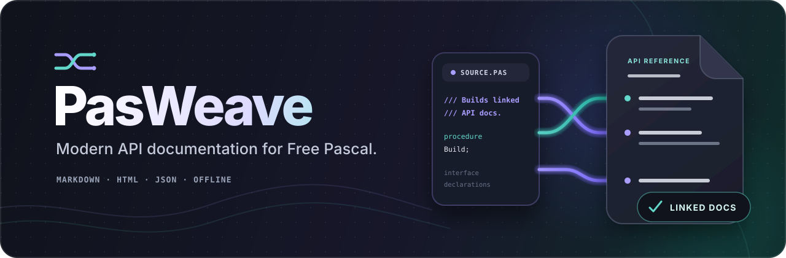

[](CHANGELOG.md)
[](docs/parser-integration.md)
[](docs/releasing.md)
[](src/model/PasWeave.Model.JSON.pas)
[](LICENSE)

PasWeave is an early-stage documentation generator designed primarily for
Free Pascal projects. It is written in Free Pascal and builds its source model
with FPC's reusable `fcl-passrc` parser libraries.

> **Documentation syntax:** `///` is PasWeave's own explicit documentation
> marker, not a special Free Pascal or `fcl-passrc` feature. FPC reads it as an
> ordinary `//` comment; PasWeave gives the third slash its documentation
> meaning. Accordingly, `--doc-comments=slash` means consecutive `///` lines
> only. Ordinary `//` comments are never treated as API documentation.

## ✅ Current features

The working parser-to-site pipeline includes:

- a `pasweave build` command for one Pascal unit or a directory of `.pas` and
  `.pp` units, with opt-in recursive discovery and include/exclude filters;
- interface parsing through `fcl-passrc`;
- compiler-aware parsing with repeatable unit paths, include paths, and
  conditional defines plus explicit normalized target OS and CPU settings;
- Lazarus `.lpi` project and `.lpk` package inputs with build-mode selection,
  imported compiler settings, and deterministic local-package discovery;
- parser-independent project, unit, symbol, directive, and diagnostic models;
- source-backed association of enabled PasWeave `///`, Pascal `{ ... }`, and
  Pascal `(* ... *)` documentation groups, with `///` as the safe default;
- structural extraction of `@param`, `@returns`, `@raises`, `@deprecated`,
  `@see`, and `@since`;
- deterministic, human-readable UTF-8 JSON;
- a deterministic Markdown project index and one page per parsed unit;
- stable overload-aware anchors, internal dependency links, parent links,
  fenced Pascal declarations, directive sections, and visible undocumented
  API warnings;
- a responsive static HTML project index and one page per parsed unit;
- dependency-free, offline client-side search across every renderable API
  symbol;
- shared styling with light and dark colour schemes, safe Markdown-to-HTML
  conversion, and offline KaTeX rendering for marked inline and display
  mathematics;
- deterministic, linked Mermaid diagrams of project-local interface
  dependencies and semantically resolved class/interface relationships, each
  with independent accessible zoom, pan, reset, and linked text fallback;
- per-file error isolation, concise summaries, and meaningful exit codes.

The Markdown renderer consumes only PasWeave's model. FPC parser classes remain
contained behind the adapter.

## Scope

PasWeave targets Free Pascal and `{$mode objfpc}` first. Delphi-compatible
syntax is accepted only where it works naturally through FPC's parser.
PasWeave does not contain a Pascal parser of its own.

PasWeave is not a fork of PasDoc or FPDoc. It explores a Free Pascal-first
workflow centred on Markdown, structured output and modern static
documentation. We appreciate the substantial work those projects have
contributed to the Pascal ecosystem.

## Download

Windows users can download the portable `pasweave.exe` from the
[GitHub Releases page](https://github.com/ikelaiah/pasweave/releases). It does
not use an installer, modify the registry, or require Free Pascal at runtime.
The executable contains the offline KaTeX and Mermaid assets needed by the
HTML renderer.

Place it anywhere and run:

```powershell
.\pasweave.exe --version
.\pasweave.exe build path\to\project --output docs
```

Each release also provides `pasweave.exe.sha256` for integrity verification:

```powershell
Get-FileHash .\pasweave.exe -Algorithm SHA256
```

Early pre-release executables are not code-signed, so Windows may display a
SmartScreen warning. Download only from the PasWeave release page and compare
the SHA-256 value before running the executable.

Read the [v0.3.0 release notes](RELEASE_NOTE_v0.3.0.md) for the highlights,
compatibility details, validation results, and known limitations. The
complete project history is maintained in the
[changelog](CHANGELOG.md).

## Requirements

These requirements apply only when compiling PasWeave from source:

- Free Pascal 3.2.2 or newer
- the FPC `fcl-passrc` and `fcl-json` packages

The current adapter was inspected and tested specifically against FPC 3.2.2.
See [the parser integration notes](docs/parser-integration.md) for the exact
APIs used and known uncertainties.

The first real-world run against all 45 source units in
[`mathlib-fp`](https://github.com/ikelaiah/mathlib-fp) produced 2,338 symbols
with no parse errors, missing source positions, or duplicate stable IDs. See
[the validation report](docs/mathlib-fp-validation.md) for the tested revision,
determinism result, and its important comment-syntax finding.

## Compile

With a POSIX-compatible `make`:

```text
make
make test
```

Directly with FPC from the repository root:

```text
mkdir -p build/bin build/tests build/units
fpc -Mobjfpc -Sh -Fusrc/cli -Fusrc/diagnostics -Fusrc/model -Fusrc/parser -Fusrc/render -FUbuild/units -FEbuild/bin src/pasweave.lpr
fpc -Mobjfpc -Sh -Fusrc/cli -Fusrc/diagnostics -Fusrc/model -Fusrc/parser -Fusrc/render -FUbuild/units -FEbuild/tests tests/test_pasweave.pas
```

On PowerShell, create the directories with:

```powershell
New-Item -ItemType Directory -Force build/bin, build/tests, build/units
```

Run the test executable from the repository root so it can find its fixture:

```text
build/tests/test_pasweave
```

To build the standalone Windows release executable and perform its isolated
smoke test:

```powershell
.\scripts\build-portable-windows.ps1
```

This writes only `dist\pasweave.exe` and its checksum as release artifacts;
there is no installer or ZIP package. See the
[release procedure](docs/releasing.md) for the isolated smoke test, version-tag
rules, and public-release license gate.

## Use

```text
build/bin/pasweave build tests/fixtures --output build/docs
```

For a small project whose public API is deliberately documented with
PasWeave `///` comments, generate the
[documented API example](examples/documented-api/README.md):

```text
build/bin/pasweave build examples/documented-api --output build/documented-api --project-name "Documented API example"
```

Its HTML index reports `10 of 10 API symbols documented`, providing an
immediate example of a fully populated `DOCUMENTED` column.

You can also browse the checked-in
[Markdown sample](examples/documented-api/sample-output/markdown/index.md) or
clone the repository and open the
[HTML sample](examples/documented-api/sample-output/html/index.html) directly.
The snapshot shows the actual project index and both generated unit pages.

For a more substantial equation-rich demonstration, see the runnable
[scientific API example](examples/scientific-api/README.md). Its checked-in
[Markdown output](examples/scientific-api/sample-output/markdown/index.md) and
[HTML output](examples/scientific-api/sample-output/html/index.html) document
30 of 30 public API symbols with 16 display equations and 65 inline
mathematical expressions.

For a nested source tree, enable recursive discovery explicitly and exclude
trees that are not part of the public API:

```text
pasweave build src --recursive --exclude=generated/** --exclude=tests --exclude=vendor/**
```

`--include` and `--exclude` are repeatable, case-insensitive globs relative to
the supplied source directory. `*` and `?` match within one path segment;
`**` as a complete segment spans directories. Exclusions take precedence.
Without `--recursive`, directory input retains the original top-level-only
behavior. See [source discovery](docs/source-discovery.md) for the complete
matching and safety contract.

To reproduce the interface selected by a configured FPC build, supply its
source paths, defines, and target explicitly:

```text
pasweave build src --recursive \
  --unit-path=packages/core/src \
  --include-path=include \
  --define=USE_FAST_MATH \
  --target-os=linux \
  --target-cpu=aarch64
```

`--unit-path`, `--include-path`, and `--define` are repeatable. Paths are
searched in command-line order; the first match wins. Explicit targets replace
the host defaults and are normalized before `fcl-passrc` sees them. See
[compiler-aware parsing](docs/compiler-aware-parsing.md) for supported values,
precise precedence, diagnostics, and limitations.

Lazarus projects and packages can provide those settings directly. Point the
build command at an `.lpi` or `.lpk`; no Lazarus process is started:

```text
pasweave build path/to/Application.lpi --build-mode=Release \
  --package-path=path/to/local-packages --output build/docs
```

PasWeave imports project/package units, source and include paths, defines, and
target settings. Explicit command-line compiler options override imported
values; imported project/package settings override PasWeave defaults. The
default package scan is deterministic and prunes generated, vendor, example,
and test trees. Use repeatable `--package-path` values when a local package
intentionally lives in one of those trees. See the
[Lazarus project and package guide](docs/lazarus-projects.md) for supported
XML elements and diagnostics.

The command writes:

```text
build/docs/
├── api-model.json
├── html/
│   ├── index.html
│   ├── assets/
│   │   ├── app.js
│   │   ├── diagram.js
│   │   ├── katex/
│   │   │   ├── fonts/
│   │   │   ├── katex.min.css
│   │   │   ├── katex.min.js
│   │   │   └── LICENSE
│   │   ├── math.js
│   │   ├── mermaid/
│   │   │   ├── mermaid.tiny.js
│   │   │   └── LICENSE
│   │   ├── search-index.js
│   │   └── site.css
│   └── units/
│       └── SimpleUnit.html
└── markdown/
    ├── index.md
    └── units/
        └── SimpleUnit.md
```

The command exits with `0` when every input parsed, `1` when usable output was
produced with one or more per-file parse errors, `2` for command-line or input
errors, and `3` for an unexpected internal failure. `--verbose` adds the
underlying exception class and adapter mode without printing a stack trace.

In `api-model.json`, class and interface symbols expose a
`typeRelationships` array. Each entry records `kind` (`inherits` or
`implements`), the typed-AST `targetName`, its source-like `displayName`, and a
stable `targetSymbolId` when the target resolves inside the documented
project. An empty target ID is an explicit unresolved result.

## Documentation comments

PasWeave deliberately defines `///` as its explicit documentation marker.
`fcl-passrc` does not classify triple-slash comments as documentation: it
parses the declaration structure and supplies source positions, then PasWeave
reads the original source and associates enabled comments itself. In the CLI,
the style name `slash` therefore means exactly `///`; it does not mean ordinary
`//` comments.

By default, place consecutive PasWeave `///` lines immediately before an
interface declaration:

```pascal
/// Returns the standard normal probability density.
///
/// $$
/// \phi(x) = \frac{1}{\sqrt{2\pi}}e^{-x^2/2}
/// $$
///
/// @param X Point at which the density is evaluated.
/// @returns The probability density at `X`.
function NormalPDF(const X: Double): Double;
```

Ordinary Markdown and mathematical delimiters are retained in
`markdownDocumentation`. The original `///` form is retained in
`rawDocumentation`, while recognised directives are also emitted as structured
objects.

Projects that deliberately use ordinary Pascal comments for API documentation
can opt into one or both block forms:

| `--doc-comments` value | Source form treated as documentation |
|---|---|
| `slash` | Consecutive `///` lines only; plain `//` is ignored |
| `brace` | Standalone `{ ... }` comments |
| `paren` | Standalone `(* ... *)` comments |
| `all` | `slash`, `brace`, and `paren` together |

```text
pasweave build src --doc-comments=slash
pasweave build src --doc-comments=brace
pasweave build src --doc-comments=paren
pasweave build src --doc-comments=slash,brace,paren
pasweave build src --doc-comments=all
```

The space-separated form, such as `--doc-comments brace`, is also accepted.
Enabled forms may be mixed in one standalone group and are merged in source
order:

```pascal
/// Computes a scaled value.
{ @param X Input value. }
(* @returns The scaled result. *)
function Scale(const X: Double): Double;
```

A group must directly precede its interface declaration. A blank line,
compiler directive, disabled comment form, or other source token ends the
association. Block groups must start on an otherwise blank source line, so a
trailing comment such as `X: Double; { describes X }` cannot drift onto the
next declaration. Compiler directives in `{$...}` and `(*$...*)` are never
documentation.

Opting into `brace` or `paren` is intentionally broad: section labels and
commented-out declarations can look exactly like ordinary documentation. Use
those modes only where the project's comment conventions make that trade-off
acceptable. The original delimiters are retained in `rawDocumentation`; the
combined bodies and supported structured directives are normalized into the
other model fields.

## Markdown output

`markdown/index.md` contains project totals, documentation coverage, links to
every successfully parsed unit, and any build diagnostics. Each unit page
contains:

- source and interface-dependency information;
- linked public and protected types, routines, members, constants, and
  variables;
- stable explicit anchors that distinguish overloads;
- fenced `pascal` declarations;
- preserved Markdown and mathematical delimiters;
- parameter, return, raised-exception, deprecation, version, and see-also
  sections;
- a visible warning for every undocumented API symbol.

Private and strict-private symbols remain in `api-model.json` but are omitted
from the generated API pages.

## Static HTML output

Open `html/index.html` directly in a browser. The generated site requires no
web server or network connection; its KaTeX and Mermaid runtimes, styles,
fonts, and licenses are copied into the output. It contains:

- a responsive project overview and linked unit pages;
- the same stable symbol anchors and visibility filtering as Markdown;
- escaped Pascal declarations and safely rendered documentation prose;
- offline rendering of marked display and inline mathematics, with the
  original delimited source left readable when an expression is invalid;
- a linked Mermaid graph of project-local interface dependencies on the index,
  backed by an initially expanded textual list when diagrams are unavailable;
- a linked class/interface relationship graph generated from resolved model
  data, with generic and unresolved targets preserved in its text fallback;
- per-diagram controls for bounded zoom, directional pan, and reset, with
  keyboard shortcuts, mouse dragging, reduced-motion support, and independent
  view state;
- an offline search index covering names, qualified names, kinds, units, and
  documentation summaries;
- keyboard search focus with `/` and dismissal with Escape;
- build diagnostics and visible documentation-coverage totals.

The HTML, stylesheet, JavaScript, and search index are deterministic UTF-8
files with LF line endings. See [the HTML renderer notes](docs/html-renderer.md)
for its offline-search, safety, and Markdown-subset contracts.

## ⚠️ Current limitations

- mathematical rendering supports KaTeX's TeX subset rather than arbitrary
  LaTeX; invalid or unsupported expressions remain visible as source;
- the dependency-free Markdown-to-HTML conversion intentionally supports a
  focused subset rather than every Markdown extension;
- Lazarus package discovery requires local `.lpk` files; external Lazarus/FPC
  packages must be made available through an explicit package path;
- type relationship resolution is limited to the current unit and its
  interface dependencies; ancestors outside the documented source set remain
  explicitly unresolved, and implementation bodies are not analysed;
- ordinary block-comment modes cannot semantically distinguish API prose from
  section labels or commented-out code; they therefore remain explicit
  project opt-ins;
- configured unit paths resolve source `.pas` and `.pp` files, not compiled
  `.ppu` files, and do not recurse;
- explicit OS and CPU values are validated independently, but PasWeave does
  not claim every possible pair is a real FPC code-generation target;
- no fixture coverage yet for every requested symbol kind or unusual FPC
  syntax.

## License

PasWeave is released under the [MIT License](LICENSE). Bundled third-party
components retain their own licenses; see
[THIRD_PARTY_NOTICES.md](THIRD_PARTY_NOTICES.md).

## 🧭 Roadmap

The Lazarus project/package milestone is complete in `v0.3.0`. See
[ROADMAP.md](ROADMAP.md) for its acceptance evidence and the remaining
longer-term sequence.
